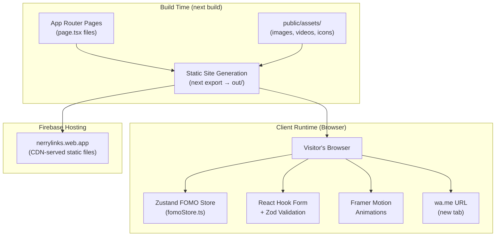

# Design Document

## Overview

NerryLink Computer and Gadgets website is a fully static Next.js 14+ site deployed to Firebase Hosting (nerrylinks.web.app). It serves as the primary digital storefront and contact channel for a Nigerian tech retail and services business. The site showcases products (computers, mobile devices, automotive), services (technical and support), and enables customer contact via WhatsApp and a booking form.

The design follows a glassmorphism/liquid glass aesthetic inspired by iOS 24, using semi-transparent panels, backdrop blur, and layered depth. All interactivity is client-side only — no server runtime, no API keys, no backend. WhatsApp (wa.me) is the primary conversion channel.

### Key Design Decisions

- **Static export** (`output: 'export'`) keeps hosting costs at zero on Firebase's free tier and eliminates server-side attack surface.
- **WhatsApp-first contact** aligns with Nigerian mobile usage patterns; the floating button and form both funnel to wa.me.
- **FOMO system via Zustand** keeps urgency state centralised and reactive without a backend, using client-side timers and static seed data.
- **No Google Maps API key** — the map embed uses a plain `<iframe>` with a pre-generated embed URL.
- **Framer Motion** handles all animations to keep them declarative and performant (GPU-accelerated transforms).

---

## Architecture

The application is a Next.js 14 App Router project configured for full static export. All pages are pre-rendered at build time to plain HTML/CSS/JS files in the `out/` directory, which Firebase Hosting serves directly.



### Data Flow

1. Visitor requests a page → Firebase CDN serves pre-built HTML.
2. React hydrates the page in the browser.
3. Zustand store initialises with static seed data (countdown targets, stock levels, view counts).
4. FOMO components subscribe to the store and update on a 1-second interval (CountdownTimer).
5. Contact form collects input → Zod validates → WhatsApp_Integration constructs wa.me URL → opens in new tab.

---

## Components and Interfaces

### UI Primitives (`src/components/ui/`)

#### GlassCard

```typescript
interface GlassCardProps {
  children: React.ReactNode;
  className?: string;
  onClick?: () => void;
}
```

Renders a `<div>` with the `.glass` utility class applied. Supports optional click handler for product/service cards.

#### GlassButton

```typescript
interface GlassButtonProps {
  children: React.ReactNode;
  onClick?: () => void;
  href?: string;
  variant?: 'primary' | 'secondary' | 'whatsapp';
  type?: 'button' | 'submit';
  disabled?: boolean;
  className?: string;
}
```

Renders a `<button>` or Next.js `<Link>` (when `href` is provided) styled with `.glass`. The `whatsapp` variant applies `#25D366` accent colouring.

#### GlassModal

```typescript
interface GlassModalProps {
  isOpen: boolean;
  onClose: () => void;
  title: string;
  children: React.ReactNode;
}
```

Renders a full-screen overlay with a centred panel styled with `.glass-dark`. Traps focus using a focus-trap pattern (Tab/Shift+Tab cycle within modal, Escape closes). Mounts/unmounts with Framer Motion `AnimatePresence`.

---

### Layout Components (`src/components/layout/`)

#### Header

```typescript
interface HeaderProps {} // no props — reads route from usePathname()
```

Fixed top bar. Applies `.glass` background after scroll (via `useScrollPosition` hook). Contains brand logo/name and `<Navigation>`.

#### Navigation

```typescript
interface NavigationProps {
  mobile?: boolean;
}
```

Renders nav links: Home `/`, About `/about`, Products `/products`, Services `/services`, Team `/team`, Contact `/contact`. Highlights active route. On mobile, renders as a hamburger-triggered slide-down menu.

#### Footer

No props. Renders business name, PrimaryWhatsApp (`+2348166490440`), working hours (Mon–Sat 09:00–19:30), Facebook link, and copyright.

---

### Section Components (`src/components/sections/`)

#### Hero

```typescript
interface HeroProps {} // reads FOMO store internally
```

Full-viewport-height section. Background: `assets/Home Hero section.jpeg` with dark overlay. Contains headline, sub-headline, two GlassButtons (Shop Now → `/products`, Contact Us → `/contact`), and `<CountdownTimer>`.

#### ProductShowcase

```typescript
interface ProductShowcaseProps {
  products: Product[]; // defined in Data Models
}
```

Renders category tabs and product GlassCards. Clicking a card opens a GlassModal with product detail and WhatsApp inquiry button.

#### ServiceGrid

```typescript
interface ServiceGridProps {
  services: Service[]; // defined in Data Models
}
```

Two-column grid of service GlassCards. Clicking opens a GlassModal with description and "Book via WhatsApp" GlassButton.

#### TeamSection

```typescript
interface TeamSectionProps {
  members: TeamMember[]; // defined in Data Models
}
```

Three-column grid of team GlassCards with photo, name, role, and Facebook link.

#### ContactSection

```typescript
interface ContactSectionProps {} // contains ContactForm and map iframe
```

Wraps `<ContactForm>` and the Google Maps `<iframe>` embed.

---

### FOMO Components (`src/components/fomo/`)

#### CountdownTimer

```typescript
interface CountdownTimerProps {
  targetDate: string; // ISO 8601 datetime string
}
```

Displays `DD : HH : MM : SS` countdown. Uses `setInterval` (1000ms) in a `useEffect`. When target is reached, displays "Offer Expired" and clears interval.

#### StockIndicator

```typescript
interface StockIndicatorProps {
  quantity: number;
}
```

Displays "Only {quantity} left in stock!" when `quantity ≤ 5`, otherwise "In Stock".

#### SocialProof

```typescript
interface SocialProofProps {
  viewCount: number;
}
```

Displays "{viewCount} people viewed this today".

---

### Form Components (`src/components/forms/`)

#### ContactForm

```typescript
interface ContactFormProps {} // uses React Hook Form internally
```

Ten-field form. On valid submission, calls `generateWhatsAppMessage()` from `src/lib/whatsapp.ts` and opens the wa.me URL.

#### WhatsAppIntegration (Floating Button)

```typescript
interface WhatsAppIntegrationProps {} // no props
```

Fixed bottom-right FAB. Always visible. Pulsing animation via Framer Motion. Opens `https://wa.me/2348166490440` in new tab on click.

---

### Library Modules (`src/lib/`)

#### `whatsapp.ts`

```typescript
export function generateWhatsAppMessage(data: ContactFormData): string
export function buildWhatsAppURL(phone: string, message: string): string
export function openWhatsApp(data: ContactFormData): void
```

#### `validation.ts`

```typescript
export const contactFormSchema: z.ZodObject<...>
export function isWithinWorkingHours(date: string, time: string): boolean
export function getOutOfHoursMessage(): string
```

#### `utils.ts`

```typescript
export function cn(...classes: string[]): string  // clsx/tailwind-merge helper
export function formatCountdown(ms: number): CountdownDisplay
```

---

### Zustand Store (`src/store/fomoStore.ts`)

```typescript
interface FOMOState {
  countdownTarget: string;        // ISO datetime for current promotion
  stockLevels: Record<string, number>; // productId → quantity
  viewCounts: Record<string, number>;  // productId → daily views
  setCountdownTarget: (target: string) => void;
  setStockLevel: (productId: string, qty: number) => void;
  setViewCount: (productId: string, count: number) => void;
}
```

---

## Data Models

### Product

```typescript
interface Product {
  id: string;
  name: string;
  category: 'computers' | 'mobile' | 'automotive';
  description: string;
  imagePath: string;       // relative to public/assets/images/
  isRefurbished: boolean;
  whatsappInquiryText: string;
}
```

Products are defined as static data in `src/lib/products.ts`. No database.

### Service

```typescript
interface Service {
  id: string;
  name: string;
  category: 'technical' | 'support';
  description: string;
  iconName: string;        // maps to SVG icon component
  whatsappBookingText: string;
}
```

### TeamMember

```typescript
interface TeamMember {
  id: string;
  name: string;
  role: string;
  photoUrl: string;        // Facebook CDN URL or local fallback
  facebookUrl: string;
}
```

Static data:
```typescript
const team: TeamMember[] = [
  { id: 'oko', name: 'Oko Jerimial Ekpa', role: 'CEO', ... },
  { id: 'eric', name: 'Eric Oloyede', role: 'Chief Operations and Marketing', ... },
  { id: 'denis', name: 'Denis Christopher', role: 'Chief Technician', ... },
];
```

### ContactFormData

```typescript
interface ContactFormData {
  name: string;
  lastName: string;
  nickname?: string;
  email?: string;
  phone: string;
  area: string;
  state: string;
  serviceNeeds: string;   // max 100 words
  date: string;           // YYYY-MM-DD
  time: string;           // HH:MM (24h)
}
```

### CountdownDisplay

```typescript
interface CountdownDisplay {
  days: number;
  hours: number;
  minutes: number;
  seconds: number;
  expired: boolean;
}
```

---

## Correctness Properties

*A property is a characteristic or behavior that should hold true across all valid executions of a system — essentially, a formal statement about what the system should do. Properties serve as the bridge between human-readable specifications and machine-verifiable correctness guarantees.*

### Property 1: Working hours validation rejects out-of-range inputs

*For any* date/time combination that falls on a Sunday or outside 09:00–19:30 Monday–Saturday, `isWithinWorkingHours(date, time)` SHALL return `false`.

**Validates: Requirements 9.3**

### Property 2: Working hours validation accepts in-range inputs

*For any* date/time combination that falls on a Monday–Saturday between 09:00 and 19:30 inclusive, `isWithinWorkingHours(date, time)` SHALL return `true`.

**Validates: Requirements 9.3**

### Property 3: WhatsApp message template completeness

*For any* valid `ContactFormData` object, `generateWhatsAppMessage(data)` SHALL produce a string that contains the visitor's full name, area, state, serviceNeeds, date, and time fields verbatim.

**Validates: Requirements 9.4**

### Property 4: WhatsApp message nickname inclusion

*For any* `ContactFormData` where `nickname` is a non-empty string, `generateWhatsAppMessage(data)` SHALL include the nickname in the output. *For any* `ContactFormData` where `nickname` is absent or empty, the output SHALL omit the nickname clause.

**Validates: Requirements 9.4**

### Property 5: CountdownTimer display correctness

*For any* target ISO datetime string that is in the future, `formatCountdown(ms)` SHALL return a `CountdownDisplay` where `days * 86400 + hours * 3600 + minutes * 60 + seconds` equals the total remaining seconds (within ±1 second tolerance for rounding).

**Validates: Requirements 11.2**

### Property 6: CountdownTimer expiry

*For any* target datetime that is in the past or equal to now, `formatCountdown(ms)` SHALL return a `CountdownDisplay` with `expired: true` and all numeric fields set to `0`.

**Validates: Requirements 11.3**

### Property 7: StockIndicator threshold

*For any* `quantity` value of 5 or fewer (including 0), `StockIndicator` SHALL render text containing "Only {quantity} left in stock!". *For any* `quantity` greater than 5, it SHALL render "In Stock".

**Validates: Requirements 11.4, 11.5**

### Property 8: SocialProof display

*For any* non-negative integer `viewCount`, `SocialProof` SHALL render a string containing that exact number followed by "people viewed this today".

**Validates: Requirements 11.6**

### Property 9: Contact form Zod schema rejects invalid submissions

*For any* `ContactFormData` object missing one or more required fields (name, lastName, phone, area, state, serviceNeeds, date, time), `contactFormSchema.safeParse(data)` SHALL return `{ success: false }`.

**Validates: Requirements 9.1, 9.2**

### Property 10: Contact form Zod schema accepts valid submissions

*For any* `ContactFormData` object with all required fields populated and a valid email (if provided), `contactFormSchema.safeParse(data)` SHALL return `{ success: true }`.

**Validates: Requirements 9.1, 9.2**

### Property 11: serviceNeeds word count enforcement

*For any* `serviceNeeds` string exceeding 100 words, `contactFormSchema.safeParse({ ..., serviceNeeds })` SHALL return `{ success: false }`.

**Validates: Requirements 9.1**

---

## Error Handling

### Form Validation Errors

- React Hook Form surfaces Zod errors inline, adjacent to each field.
- The out-of-hours error message is a fixed string (per Requirement 9.3) displayed below the date/time fields.
- The `serviceNeeds` word count indicator turns red when the limit is exceeded.

### Image Load Failures

- Team member photos use an `onError` handler to swap `src` to a local SVG placeholder avatar.
- Product images use Next.js `Image` with a `placeholder="blur"` blurDataURL fallback.

### WhatsApp URL Construction

- `buildWhatsAppURL` encodes the message with `encodeURIComponent` before appending to `https://wa.me/`.
- If `window.open` is blocked by the browser, the function falls back to setting `window.location.href`.

### CountdownTimer Edge Cases

- If `targetDate` is not a valid ISO string, the component renders "Offer Expired" immediately.
- The interval is cleared on component unmount to prevent memory leaks.

### Static Export Constraints

- No `getServerSideProps` or API routes — any attempt to use them will fail the build.
- Dynamic routes (e.g., `/products/[id]`) require `generateStaticParams` to enumerate all IDs at build time.

---

## Testing Strategy

### Unit Tests (Vitest + React Testing Library)

Focus on specific examples, edge cases, and error conditions:

- `isWithinWorkingHours`: concrete examples for Sunday, Monday 09:00, Saturday 19:30, Saturday 19:31.
- `generateWhatsAppMessage`: example with and without nickname, verifying template output.
- `formatCountdown`: specific millisecond values mapping to known day/hour/minute/second breakdowns.
- `contactFormSchema`: valid and invalid form data examples.
- `StockIndicator`: renders correctly at quantity 0, 5, 6, and 100.
- `GlassModal`: focus trap behaviour, Escape key closes modal.

### Property-Based Tests (fast-check)

Each property test runs a minimum of 100 iterations. Tests are tagged with the property they validate.

**Library**: [fast-check](https://fast-check.io/) — a mature TypeScript-native property-based testing library.

- **Property 1 & 2** (`isWithinWorkingHours`): Generate random Sunday dates → assert `false`; generate random Mon–Sat dates with times in [09:00, 19:30] → assert `true`.
  - Tag: `Feature: nerrylink-website, Property 1-2: working hours validation`

- **Property 3 & 4** (`generateWhatsAppMessage`): Generate random `ContactFormData` objects → assert all required fields appear in output; generate with/without nickname → assert conditional inclusion.
  - Tag: `Feature: nerrylink-website, Property 3-4: WhatsApp message template`

- **Property 5 & 6** (`formatCountdown`): Generate random future/past millisecond offsets → assert arithmetic correctness and expiry flag.
  - Tag: `Feature: nerrylink-website, Property 5-6: countdown timer display`

- **Property 7** (`StockIndicator`): Generate random integers ≤ 5 and > 5 → assert correct render text.
  - Tag: `Feature: nerrylink-website, Property 7: stock indicator threshold`

- **Property 8** (`SocialProof`): Generate random non-negative integers → assert viewCount appears in rendered output.
  - Tag: `Feature: nerrylink-website, Property 8: social proof display`

- **Properties 9, 10, 11** (`contactFormSchema`): Generate random objects with missing required fields → assert `success: false`; generate fully valid objects → assert `success: true`; generate serviceNeeds strings > 100 words → assert `success: false`.
  - Tag: `Feature: nerrylink-website, Property 9-11: contact form schema`

### Integration / Smoke Tests

- Build smoke test: `next build` completes without error and `out/` directory contains `index.html`.
- Firebase deploy smoke test: `firebase deploy --only hosting` succeeds (CI only).
- Lighthouse CI: desktop performance score ≥ 90, LCP < 2.5s (run against `out/` via `http-server`).

### Accessibility Checks

- `axe-core` via `@axe-core/react` in development mode to surface WCAG violations during development.
- Manual keyboard navigation walkthrough for all interactive elements.
